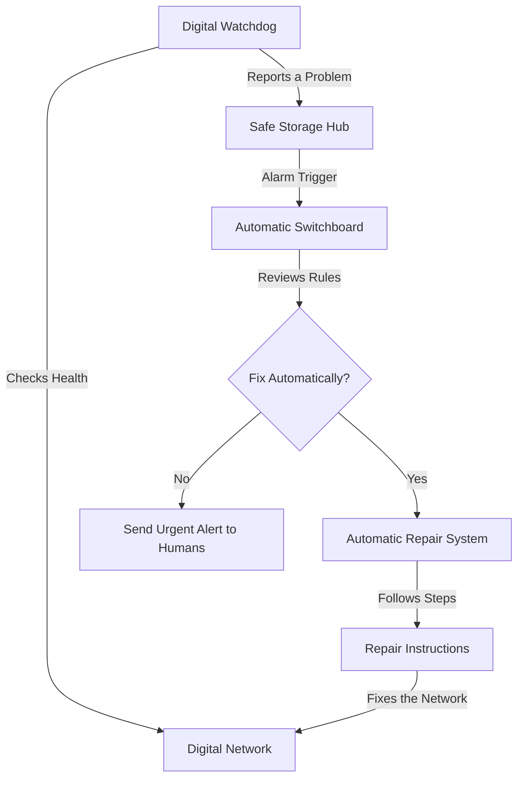

# ChainWard: An Automatic Safety System for Digital Infrastructure

**ChainWard** is a digital watchdog that protects custom blockchains (digital networks). It constantly monitors the network's health, detects glitches, and automatically repairs them before they can cause downtime or financial loss—all without needing a human to press a button.

---

## 🏗️ How it Works (The Simple Version)

ChainWard works like an advanced security system for a building. It watches the network's activity and has a set of "automatic repair" steps ready for when something goes wrong.



---

## ✨ What ChainWard Does for You

### 1. Automatic Repairs (V3.0)
Most systems just send an alert when they break. ChainWard actually **fixes** the problem. For example, if the network slows down, ChainWard can automatically trigger steps to speed it back up or secure funds instantly.
- **Lightning Fast**: It detects and fixes problems in seconds.
- **No Human Required**: It works 24/7, even while you sleep.

### 2. Permanent Public Logs
Every time a problem is detected or fixed, the details are written into a "digital stone" that can't be edited or deleted. This ensures full transparency—no one can hide a network failure.
- **Full History**: You can see exactly when glitches happened and how they were fixed.
- **Unchangeable Evidence**: Great for audits and building trust with users.

### 3. Reliability Rewards & Deposits
The professionals running the network are required to put down a "safety deposit." If they report glitches honestly and keep the network healthy, they earn rewards. If they are dishonest, they lose part of their deposit.
- **Incentivized Honesty**: Ensures the people watching the network are always acting in your best interest.
- **Earning Potential**: Reliable operators are rewarded for their good service.

### 4. Simple Safety Rules
Control exactly how the system reacts. You can set rules like "If the network slows down for more than 5 minutes, automatically trigger a security pause."
- **Customizable**: Set the safety level that fits your specific needs.
- **Manual Overrides**: Humans can still take control whenever they need to.

---

## 🧪 See it in Action

We have already tested this system, and it worked perfectly without human intervention. You can view the **Permanent Digital Receipt** for a real repair below. This link proves the system detected a problem, started a repair, and finished it successfully—all in one go.

**[View the Permanent Repair Receipt](https://sepolia-rollup.arbitrum.io/tx/0x94df61ed4505877b32375e7b8576003603ce53ffff6e745978ba0c0259e4d198)**

| Step taken | Result |
|-------|--------|
| Problem Reported | ✅ Detected |
| Automatic Trigger | ⚡ Started |
| Repair in Progress | 🚀 Running |
| Problem Fixed | ✨ Success |

---

## 📍 Project Infrastructure (For Advanced Users)

These are the digital addresses where our safety system lives.

| System Component | Digital Address |
|----------|----------------------|
| **Chief Safety Manager** | `0x73FFF882740ed596AeA90F654Afe2BCbE57c36E1` |
| **Automatic Switchboard** | `0xC0A011F642f5eb59535f4E79CbC17EdcC6D80D92` |
| **Repair System** | `0x324E6a1F2c1Ac02AEE916608BEA8D2CBc382945E` |
| **Repair Instructions** | `0xe49F3Bb9C25971D12Bf7220B9000Ca771194d5de` |
| **Network Settings** | `0xf2D0094e9a1c33FAdCd34DA478678639Cb86e6bC` |

---

## 🚀 Setting Up

### 1. Installation
```bash
# Download the project
git clone https://github.com/sudo-robi/ChainWard.git
npm install
cd Frontend && npm install && cd ..

# Setup the system addresses
node config/sync-env.js
```

### 2. Running the System
```bash
# Open the Dashboard (Visual interface)
cd Frontend
npm run dev

# Start the Digital Watchdog (Background monitor)
node agent/healthMonitor.js
```

---

## 📄 License
ChainWard is released under the MIT License. Built to make custom blockchains safer and more reliable.
