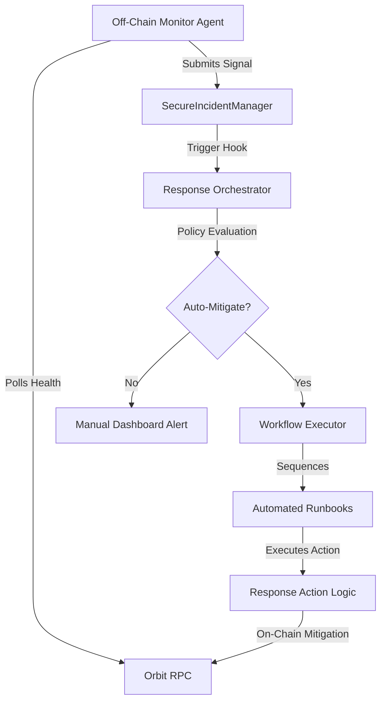

# ChainWard: Autonomous Reliability for Orbit Chains

[](https://arbitrum.io/orbit)
[](https://opensource.org/licenses/MIT)
[](https://github.com/sudo-robi/ChainWard)

**ChainWard** is the industry's first full-stack autonomous response layer designed specifically for Arbitrum Orbit chains. It provides proactive monitoring, decentralized incident reporting, and contract-driven automated mitigation to ensure chain reliability without human bottlenecks.

---

## 🏗️ The V3.0 Architecture

ChainWard V3.0 introduces a hierarchical response stack that bridges the gap between signal detection and automated recovery.



---

## ⚡ Key Features

### 1. Autonomous Mitigation (V3.0)
ChainWard transitions from "Alerting" to "Mitigating". High-priority incidents (like `BlockLag`) trigger immediate, atomic response workflows.
- **Single-Transaction Recovery**: Detection to mitigation happens in one block.
- **Runbook Sequencing**: Execute multiple defensive actions in an order defined by safety policies.

### 2. Decentralized Incident Management
Every incident is recorded on-chain, creating a permanent, auditable forensic timeline.
- **Forensic Detail**: Records last healthy block, severity, and detection latency.
- **Role-Based Reporting**: Only authorized, bonded reporters can submit incidents, preventing spam.

### 3. Economic Alignment (stAAVE Incentives)
Node operators are economically incentivized to maintain high uptime and report honestly.
- **Reporter Bonds**: Reporters must stake capital to participate.
- **Yield Accrual**: Bonded operators earn yield over time, creating a "Quality of Service" reward layer.
- **Slashing**: Dishonest reporting or missed heartbeats results in bond slashing.

### 4. Hybrid Governance Control
Admins can fine-tune response thresholds and policies via the **Command Center**.
- **Dynamic Thresholds**: Adjust `BlockLag` limits or `SequencerStall` timeouts without redeploying code.
- **Emergency Circuit Breakers**: Manual overrides for the autonomous engine.

---

## 🧪 Definitive Proof of Concept

The V3.0 infrastructure is live and verified. You can observe a full autonomous mitigation lifecycle (Detection → Response Trigger → Recovery) in the transaction below:

**[Tx: 0x94df61ed...d198](https://sepolia-rollup.arbitrum.io/tx/0x94df61ed4505877b32375e7b8576003603ce53ffff6e745978ba0c0259e4d198)**

| Event | Status | Layer |
|-------|--------|-------|
| `IncidentReported` | ✅ Success | IncidentManager |
| `IncidentResponseTriggered` | ⚡ Autonomous | Orchestrator |
| `ResponseStarted` | 🚀 Executing | Orchestrator |
| `ResponseCompleted` | ✨ Mitigation Success | Orchestrator |

---

## 📍 Deployed Addresses (Arbitrum Sepolia)

| Contract | Current V3.0 Address |
|----------|----------------------|
| **SecureIncidentManager** | `0x73FFF882740ed596AeA90F654Afe2BCbE57c36E1` |
| **IncidentResponseOrchestrator** | `0xC0A011F642f5eb59535f4E79CbC17EdcC6D80D92` |
| **WorkflowExecutor** | `0x324E6a1F2c1Ac02AEE916608BEA8D2CBc382945E` |
| **AutomatedRunbook** | `0xe49F3Bb9C25971D12Bf7220B9000Ca771194d5de` |
| **OrbitChainRegistry** | `0xf2D0094e9a1c33FAdCd34DA478678639Cb86e6bC` |

---

## 🚀 Getting Started

### 1. Install & Setup
```bash
# Clone and install
git clone https://github.com/sudo-robi/ChainWard.git
npm install
cd Frontend && npm install && cd ..

# Centralized Config Sync
# This script propagates V3 addresses from local config to all env files
node config/sync-env.js
```

### 2. Local Development
```bash
# Start the Dashboard
cd Frontend
npm run dev

# Start the Health Monitor Agent
node agent/healthMonitor.js
```

### 3. Simulation Tooling
Trigger a full autonomous flow locally to verify your configuration:
```bash
curl -X POST http://localhost:3000/api/simulate-incident \
-H "Content-Type: application/json" \
-d '{"type": "BlockLag", "priority": 1}'
```

---

## 🛠️ Tech Stack
- **Frontend**: Next.js, TailwindCSS, Ethers.js
- **Contracts**: Solidity 0.8.20, OpenZeppelin, Forge/Foundry
- **Infrastructure**: Arbitrum Sepolia Rollup
- **Orchestration**: Node.js Autonomous Agents

---

## 📄 License
ChainWard is released under the MIT License. Developed for the Arbitrum Orbit ecosystem.
